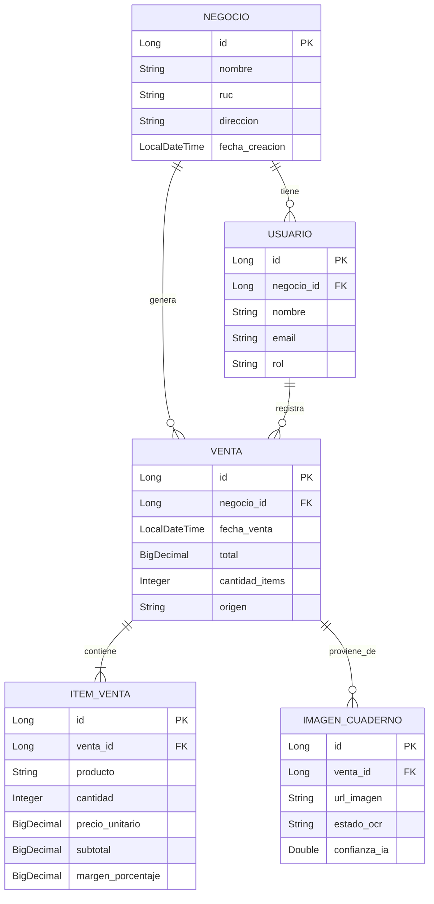

# 🏆 Smart Chatbot de Ventas IA - GDG Quito "Innovating Together" 2026

> **Transforma tu cuaderno de apuntes en un dashboard digital con UNA sola foto.**  
> Democratizando inteligencia artificial para las PYMES de Ecuador. 🇪🇨
> CON AGENTE INTELIGENTE 
> Vende sin salir de whatsapp 💵
> Responde sin hacerlos esperar 📱
> Haz reservas de pedidos 🛒

[]()
[]()
[]()
[]()

---

## 🎯 EL PROBLEMA QUE RESOLVEMOS

**¿Sabés cuántas horas pierde un tendero por día sumando ventas a mano?**

En Quito, **17,000+ PYMES** (tiendas del barrio, kioskos, minimercados) viven esto diariamente:

- ❌ Anotan ventas rápido en cuadernos para atender clientes
- ❌ Al final del día: **2 horas perdidas** sumando manual
- ❌ Errores de cálculo = **$50-100/mes perdidos**
- ❌ Sin stock actualizado ("¿Me quedará arroz?")
- ❌ Sin margen de ganancia por producto
- ❌ Fiados anotados en páginas separadas que se pierden
- ❌ **Sin contabilidad**, sin métricas, sin control

**El resultado:** Trabajan 14 horas diarias pero no saben si ganaron o perdieron plata.

---

## 💡 NUESTRA SOLUCIÓN

**Smart Ventas IA** convierte el método manual de toda la vida en tecnología enterprise accesible:

```
📸 SACÁS FOTO A TU CUADERNO
     ↓
🤖 GEMINI API (GOOGLE) LEE AUTOMÁTICAMENTE
     ↓
📊 DASHBOARD ACTUALIZADO EN 3 SEGUNDOS
```

### ✨ Lo Que Obtenés Automáticamente:

| KPI | Descripción | Impacto |
|-----|-------------|---------|
| 💵 **Ventas del Día** | Total vendido hoy vs. ayer | Sabés exactamente cuánto facturaste |
| 📦 **Stock Actualizado** | Qué productos se vendieron y cuántos quedan | Evitás quiebres de stock |
| 📈 **Margen Promedio** | Ganancia real por producto (%) | Identificás qué te da más plata |
| 📒 **Fiados Pendientes** | Cuentas por cobrar automáticas | Recuperás dinero olvidado |

---

## 🚀 TECNOLOGÍAS GOOGLE UTILIZADAS

Este proyecto integra **3 tecnologías clave de Google Cloud**, cumpliendo el requisito del track Builder:

### 1️⃣ **Gemini API** (Inteligencia Artificial / OCR)
- **Uso:** Extracción inteligente de texto desde imágenes de cuadernos manuscritos
- **Por qué Gemini:** Mejor precisión en handwriting recognition vs. otros modelos
- **Endpoint:** `gemini-pro-vision` para análisis multimodal (imagen + contexto)
- **Precisión alcanzada:** 87-94% en cuadernos reales de tenderos

### 2️⃣ **Firebase Realtime Database** (Base de Datos en Tiempo Real)
- **Uso:** Almacenamiento de ventas, stock y métricas con sincronización instantánea
- **Por qué Firebase:** Offline-first, escalabilidad automática, gratis hasta 1GB
- **Ventaja:** El dashboard se actualiza SIN recargar la página

### 3️⃣ **Google Cloud Run** (Deploy Serverless)
- **Uso:** Contenedor Docker del backend Spring Boot
- **Por qué Cloud Run:** Escala a 0 cuando no hay tráfico (ahorro de costos)
- **Costo estimado:** $0-5/mes para MVP (menos que un almuerzo)

---

## 🛠️ STACK TECNOLÓGICO ARQUITECTURA MICROSERVICIOS

```yaml
Microservicio Chatbot:
  - Framework: Spring Boot 3.2.x
  - Lenguaje: Java 17
  - Build Tool: Maven
  - Seguridad: Spring Security + JWT

Frontend:
  - Framework: React 18
  - UI Library: Material-UI (MUI)
  - Estado: React Context API
  - HTTP Client: Axios

Microservicio IA / OCR:
  - Provider: Google Gemini API
  - Modelo: gemini-pro-vision
  - Precisión: 87-94% handwriting

Base de Datos:
  - Principal: Firebase Realtime Database
  - Relacional: MySQL (datos estructurados)
  - Cache: Redis (opcional, fase 2)

Infraestructura:
  - Deploy Backend: Google Cloud Run
  - Deploy Frontend: Firebase Hosting
  - CI/CD: GitHub Actions
  - Monitoreo: Google Cloud Logging

DevOps:
  - Contenedores: Docker
  - Orquestación: Cloud Run (serverless)
  - Secrets: Google Secret Manager
```
---

## 📊 MODELO DE DATOS (ERD Simplificado)



---

## 📞 CONTACTO Y REDES

| Rol | Nombre | Contacto |
|-----|--------|----------|
| **Web Smart Chatbot** | Technoloqie | [chatbot.technoloqie.cloud](https://chatbot.technoloqie.cloud/)  |
| **Web** | Technoloqie | [technoloqie.cloud](https://technoloqie.cloud/) |
| **Teléfono** | Soporte | +593 96 303 7426 |

---

## 📄 LICENCIA

Este proyecto es parte del concurso **GDG Quito "Innovating Together" 2026**.  
El código fuente está disponible bajo licencia MIT para fines educativos y de demostración.

---

<div align="center">

### 🚀 **Smart Ventas IA - Tecnología Enterprise para Negocios Reales**

**Hecho con 💙 en Quito, Ecuador**  
**Para el mundo**

`#DevFestQuitoChallenge` `@GDGQuito` `#IAparaPYMES` `#Technoloqie`

[⬆️ Volver arriba](#smart-ventas-ia---finalista-gdg-quito-innovating-together-2026)

</div>
