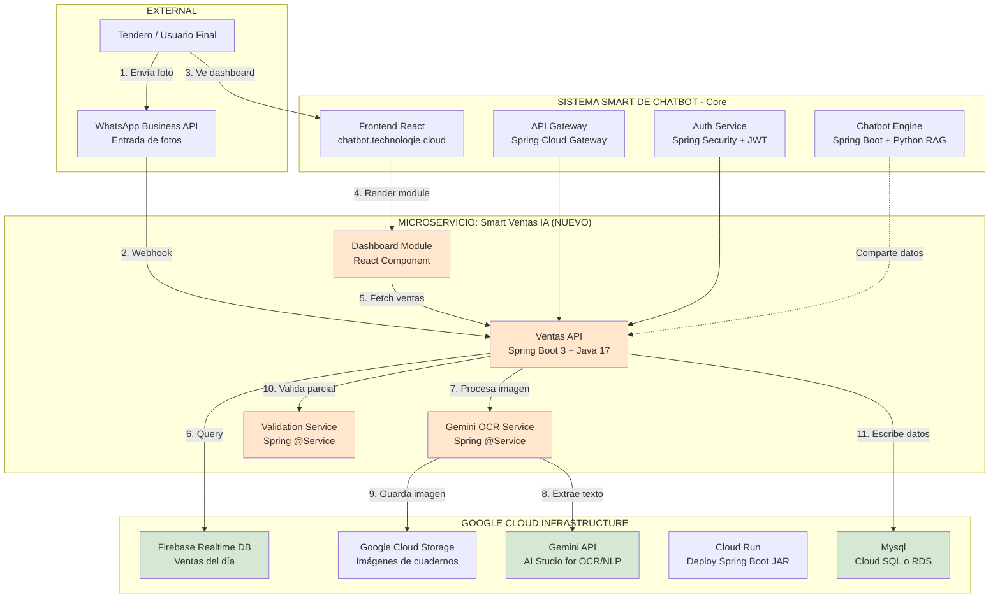
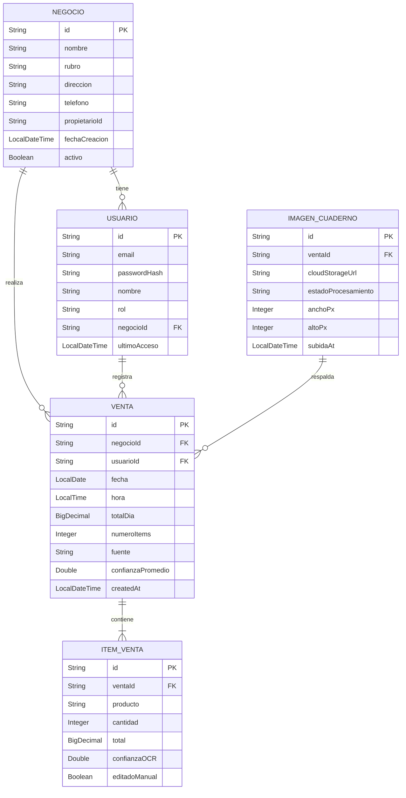
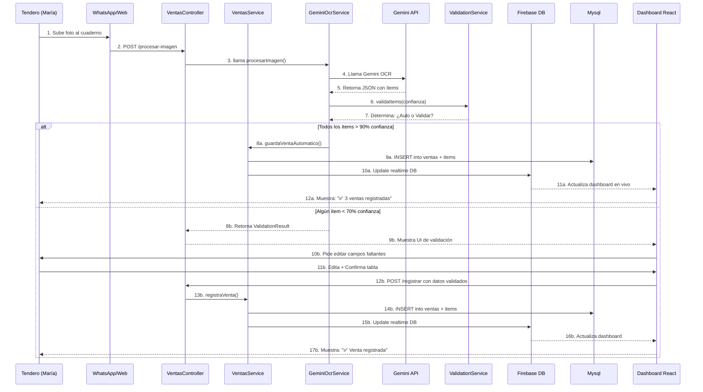

# Design Doc: Smart Ventas IA - Microservicio de Registro de Ventas con IA

**Fecha:** 11 de septiembre de 2026  
**Autor:** Diego (Fundador, Technoloqie)  
**Estado:** ✅ Aprobado para implementación  
**Concurso:** GDG Quito - Innovating Together (DevFest 2026)  
**Track:** Builder (con demo funcional en 48h)  
**Versión:** 2.0 (Actualizado: Spring Boot + Modelo de Datos ERD)

---

## 📋 TABLA DE CONTENIDOS

1. [Resumen Ejecutivo](#1-resumen-ejecutivo)
2. [Problema a Resolver](#2-problema-a-resolver)
3. [Solución Propuesta](#3-solucion-propuesta)
4. [Arquitectura del Sistema](#4-arquitectura-del-sistema)
5. [Componentes del MVP](#5-componentes-del-mvp)
6. [Modelo de Datos](#6-modelo-de-datos)
7. [Flujo de Datos](#7-flujo-de-datos)
8. [Manejo de Errores](#8-manejo-de-errores)
9. [Tecnologías Google Utilizadas](#9-tecnologías-google-utilizadas)
10. [Criterios de Aceptación](#10-criterios-de-aceptación)
11. [Métricas de Éxito](#11-métricas-de-éxito)
12. [Timeline de Implementación](#12-timeline-de-implementación)

---

## 1. RESUMEN EJECUTIVO

**Smart Ventas IA** es un microservicio Spring Boot que permite a tenderos, dueños de cafés y pequeños comerciantes registrar sus ventas diarias mediante una foto al cuaderno donde las anotan manualmente.

**Propuesta de valor:** Reducir el tiempo de cuadrar caja de 1 hora a 30 segundos, eliminando errores manuales y proporcionando métricas en tiempo real.

**Stack tecnológico:** Spring Boot 3 + Java 17 (backend), React 18 (frontend), Gemini API (IA/OCR), Firebase + Mysql (datos), Google Cloud Run (deploy).

**Contexto del concurso:** Participación en "Innovating Together" - challenge oficial previo al DevFest Quito 2026, categoría Builder, frente de innovación "Emprender + Incluir + Sostener".

---

## 2. PROBLEMA A RESOLVER

### 2.1 Situación Actual (Pre-MVP)

**Persona:** María, 45 años, dueña de "Café La Floresta" en Quito

**Dolor cotidiano:**
- Anota todas las ventas del día en un cuaderno físico
- Al final del día (8-10 PM), dedica **1 hora** a sumar manualmente
- Se equivoca **2-3 veces por semana** en cálculos
- Pierde aproximadamente **$50 mensuales** por errores no detectados
- No tiene visibilidad de métricas básicas (ticket promedio, día más fuerte)

**Datos del mercado:**
- ~17,600 PYMES en Quito usan métodos manuales de registro
- 85% no usa software contable por costo/complejidad
- Tiempo promedio perdido: 5-7 horas/semana por tendero

### 2.2 Por Qué Este Problema Es Ideal para el Concurso

✅ **Concreto y cotidiano:** No es un diagnóstico general del país, es un problema específico de un segmento identificable  
✅ **Tecnología como habilitador:** IA + móvil = solución accesible sin barreras de entrada  
✅ **Impacto medible:** Horas ahorradas, dinero recuperado, estrés reducido  
✅ **Escalable:** De Quito a Guayaquil, Cuenca, LatAm con mismo modelo

---

## 3. SOLUCION PROPUESTA

### 3.1 Descripción General

Smart Ventas IA transforma el proceso manual de registro de ventas en un flujo automatizado de 3 pasos:

```
📸 Foto → 🤖 IA detecta → ✅ Tendero valida → 📊 Dashboard actualiza
```

### 3.2 Features del MVP (48 horas)

**Feature Core:** Registro de ventas mediante foto al cuaderno

**Sub-features:**
1. **Captura de imagen:** Vía WhatsApp Business API o upload web
2. **Extracción con IA:** Gemini API OCR detecta 3 campos mínimos (producto, cantidad, total)
3. **Validación humana:** Tabla pre-llenada con opción de editar ítems de baja confianza (<70%)
4. **Guardado automático:** Firebase Realtime DB + Mysql almacenan venta del día
5. **Dashboard esencial:** 3 KPIs visibles en tiempo real (ventas del día, #ventas, ticket promedio)

**Lo que NO incluye el MVP (Fase 2+):**
- ❌ Categorización automática de productos
- ❌ Método de pago (efectivo/tarjeta)
- ❌ Proyecciones o alertas predictivas
- ❌ Exportación a Excel/PDF
- ❌ Multi-usuario o roles

### 3.3 Diferenciadores Clave

| Competencia Indirecta | Smart Ventas IA |
|----------------------|-----------------|
| Software contable tradicional ($50-200/mes, requiere capacitación) | $25/mes, sin capacitación, foto = registro |
| Apps de punto de venta (requiere cambiar hábito) | Mantiene hábito del cuaderno, solo agrega foto |
| Sheets/Excel manual (sin IA) | IA extrae automático, humano solo valida |

---

## 4. ARQUITECTURA DEL SISTEMA

### 4.1 Diagrama de Microservicios Spring Boot



### 4.2 Stack Tecnológico Detallado

| Capa | Tecnología | Propósito |
|------|-----------|----------|
| **Frontend** | React 18 + TypeScript | Dashboard module integrado en `chatbot.technoloqie.cloud` |
| **Backend API** | Spring Boot 3 + Java 17 | Microservicio `/ventas` con endpoints REST |
| **Seguridad** | Spring Security + JWT | Autenticación y autorización |
| **IA/OCR** | Gemini API (Google AI Studio) | Extracción de texto de imágenes |
| **Base de Datos Relacional** | Mysql (Cloud SQL/RDS) | Datos estructurados de negocios y usuarios |
| **Base de Datos NoSQL** | Firebase Realtime DB | Almacenamiento de ventas en tiempo real |
| **Storage** | Google Cloud Storage | Guardar imágenes de cuadernos (auditoría) |
| **Deploy** | Google Cloud Run | Contenedores serverless para Spring Boot JAR |
| **WhatsApp** | WhatsApp Business API (Meta) | Canal de entrada de fotos (opcional) |

---

## 5. COMPONENTES DEL MVP

### 5.1 Módulo de Dashboard (React)

**Ubicación:** `frontend/src/modules/ventas/DashboardVentas.tsx`

**Responsabilidades:**
- Renderizar 3 KPIs esenciales (ventas del día, #ventas, ticket promedio)
- Mostrar gráfico de barras de últimos 7 días
- Botón "📸 Registrar Venta" que abre modal de carga
- Lista de últimas ventas individuales (últimas 10 transacciones)

**Props/Estado:**
```typescript
interface DashboardVentasProps {
  negocioId: string;
  usuarioId: string;
}

interface Venta {
  id: string;
  timestamp: number;
  items: Array<{
    producto: string;
    cantidad: number;
    total: number;
  }>;
  totalDia: number;
}
```

**UI Components:**
- `KPICard` (reutilizable del sistema smart)
- `BarChart` (librería: recharts o chart.js)
- `VentaList` (lista con scroll virtualizado)
- `UploadModal` (modal para subir foto)

### 5.2 Ventas API (Spring Boot Microservice)

**Ubicación:** `microservices/ventas-api/src/main/java/com/technoloqie/ventas/`

**Estructura de Paquetes:**
```
com.technoloqie.ventas/
├── VentasApplication.java (main class)
├── controller/
│   └── VentasController.java (REST endpoints)
├── service/
│   ├── VentasService.java
│   ├── GeminiOcrService.java
│   └── ValidationService.java
├── repository/
│   ├── VentaRepository.java (JPA)
│   └── ItemVentaRepository.java (JPA)
├── model/
│   ├── Venta.java (entity)
│   ├── ItemVenta.java (entity)
│   └── dto/ (DTOs)
└── config/
    ├── FirebaseConfig.java
    └── GeminiApiConfig.java
```

**Endpoints REST:**

| Método | Ruta | Descripción | Spring Annotation |
|--------|------|-------------|------------------|
| `GET` | `/api/ventas/{negocioId}/dia` | Obtener ventas del día actual | `@GetMapping("/{negocioId}/dia")` |
| `POST` | `/api/ventas/{negocioId}/registrar` | Registrar nueva venta (con o sin IA) | `@PostMapping("/{negocioId}/registrar")` |
| `POST` | `/api/ventas/{negocioId}/procesar-imagen` | Subir imagen para procesamiento con IA | `@PostMapping("/{negocioId}/procesar-imagen")` |
| `GET` | `/api/ventas/{negocioId}/historial` | Obtener historial (últimos 7 días) | `@GetMapping("/{negocioId}/historial")` |

**Ejemplo de Controller:**

```java
@RestController
@RequestMapping("/api/ventas")
@RequiredArgsConstructor
public class VentasController {
    
    private final VentasService ventasService;
    private final GeminiOcrService geminiOcrService;
    
    @PostMapping("/{negocioId}/procesar-imagen")
    public ResponseEntity<ProcesarImagenResponse> procesarImagen(
        @PathVariable String negocioId,
        @RequestParam("imagen") MultipartFile imagen
    ) {
        try {
            byte[] imagenBytes = imagen.getBytes();
            List<ItemVentaDTO> items = geminiOcrService.procesarImagen(imagenBytes, negocioId);
            
            return ResponseEntity.ok(new ProcesarImagenResponse(items));
        } catch (IOException e) {
            return ResponseEntity.badRequest().build();
        }
    }
    
    @PostMapping("/{negocioId}/registrar")
    public ResponseEntity<Venta> registrarVenta(
        @PathVariable String negocioId,
        @RequestBody RegistroVentaRequest request
    ) {
        Venta venta = ventasService.registrarVenta(negocioId, request);
        return ResponseEntity.created(URI.create("/api/ventas/" + venta.getId())).body(venta);
    }
}
```

**Ejemplo de Request DTO:**

```java
// DTO: RegistroVentaRequest.java
public class RegistroVentaRequest {
    private String negocioId;
    private List<ItemVentaDTO> items;
    private String fuente; // "ia_ocr" o "manual"
    private Double confianzaPromedio;
    
    // Getters y Setters
}

// Ejemplo de JSON request:
{
  "negocioId": "cafe-la-floresta-001",
  "items": [
    { "producto": "Café con leche", "cantidad": 2, "total": 6 },
    { "producto": "Torta de chocolate", "cantidad": 1, "total": 4 }
  ],
  "fuente": "ia_ocr",
  "confianzaPromedio": 0.92
}
```

### 5.3 Gemini OCR Service (Spring Service)

**Ubicación:** `microservices/ventas-api/src/main/java/com/technoloqie/ventas/service/GeminiOcrService.java`

**Implementación en Spring Boot:**

```java
@Service
@RequiredArgsConstructor
@Slf4j
public class GeminiOcrService {
    
    private final GeminiApiClient geminiApiClient;
    private final CloudStorageService cloudStorageService;
    
    @Value("${google.gemini.api.key}")
    private String geminiApiKey;
    
    public List<ItemVentaDTO> procesarImagen(byte[] imagenBytes, String negocioId) {
        log.info("Iniciando procesamiento de imagen para negocio: {}", negocioId);
        
        // 1. Subir imagen a Cloud Storage
        String imageUrl = cloudStorageService.upload(imagenBytes);
        log.debug("Imagen subida a: {}", imageUrl);
        
        // 2. Llamar a Gemini API con prompt estructurado
        String prompt = construirPromptOCR();
        String respuesta = geminiApiClient.generateContent(prompt, imageUrl);
        
        // 3. Parsear respuesta JSON
        List<ItemVentaDTO> items = parsearRespuesta(respuesta);
        
        log.info("OCR completado: {} ítems detectados para negocio {}", items.size(), negocioId);
        
        return items;
    }
    
    private String construirPromptOCR() {
        return """
            Eres un asistente especializado en extraer información de imágenes de cuadernos de ventas.
            
            La imagen muestra una lista de ventas escritas a mano. Extrae CADA ítem con:
            - Nombre del producto/servicio (texto exacto)
            - Cantidad (número)
            - Total del ítem (número con símbolo $ si existe)
            
            Formato de salida: JSON array
            [
              {"producto": "Café con leche", "cantidad": 2, "total": 6, "confianza": 0.95},
              {"producto": "Torta", "cantidad": 1, "total": 4, "confianza": 0.92}
            ]
            
            Si algún campo tiene confianza < 0.70, márcalo explícitamente.
            Si no puedes detectar un ítem completo, omítelo del array.
            """;
    }
    
    private List<ItemVentaDTO> parsearRespuesta(String respuesta) {
        // Usar Jackson ObjectMapper para parsear JSON
        try {
            return objectMapper.readValue(respuesta, new TypeReference<List<ItemVentaDTO>>() {});
        } catch (JsonProcessingException e) {
            log.error("Error parseando respuesta de Gemini: {}", e.getMessage());
            throw new GeminiParseException("No se pudo parsear la respuesta de la IA", e);
        }
    }
}
```

### 5.4 Validation Service (Spring Service)

**Ubicación:** `microservices/ventas-api/src/main/java/com/technoloqie/ventas/service/ValidationService.java`

**Lógica en Java:**

```java
@Service
@Slf4j
public class ValidationService {
    
    private static final double UMBRAL_ALTA_CONFIANZA = 0.90;
    private static final double UMBRAL_BAJA_CONFIANZA = 0.70;
    
    public ValidationResult validarItems(List<ItemVentaDTO> items) {
        List<ItemVentaDTO> itemsAltamenteConfiables = items.stream()
            .filter(i -> i.getConfianza() != null && i.getConfianza() >= UMBRAL_ALTA_CONFIANZA)
            .collect(Collectors.toList());
            
        List<ItemVentaDTO> itemsBajaConfianza = items.stream()
            .filter(i -> i.getConfianza() != null && i.getConfianza() < UMBRAL_BAJA_CONFIANZA)
            .collect(Collectors.toList());
            
        List<ItemVentaDTO> itemsSinDetectar = items.stream()
            .filter(i -> i.getTotal() == null)
            .collect(Collectors.toList());
        
        if (!itemsBajaConfianza.isEmpty() || !itemsSinDetectar.isEmpty()) {
            log.info("Requiere validación: {} ítems baja confianza, {} ítems sin detectar", 
                itemsBajaConfianza.size(), itemsSinDetectar.size());
            
            return ValidationResult.requiereValidacion(
                items,
                Stream.concat(itemsBajaConfianza.stream(), itemsSinDetectar.stream())
                      .collect(Collectors.toList())
            );
        }
        
        log.info("Guardado automático: {} ítems altamente confiables", itemsAltamenteConfiables.size());
        return ValidationResult.guardadoAutomatico(itemsAltamenteConfiables);
    }
}

// Record class para resultado (Java 17+)
public record ValidationResult(
    String accion, // "GUARDADO_AUTOMATICO" o "REQUIERE_VALIDACION"
    List<ItemVentaDTO> itemsPreLlenados,
    List<ItemVentaDTO> itemsAEditar
) {
    public static ValidationResult guardadoAutomatico(List<ItemVentaDTO> items) {
        return new ValidationResult("GUARDADO_AUTOMATICO", items, Collections.emptyList());
    }
    
    public static ValidationResult requiereValidacion(
        List<ItemVentaDTO> todos,
        List<ItemVentaDTO> aEditar
    ) {
        return new ValidationResult("REQUIERE_VALIDACION", todos, aEditar);
    }
}
```

---

## 6. MODELO DE DATOS

### 6.1 Diagrama Entidad-Relación (Mermaid ERD)



### 6.2 Descripción de Entidades

**NEGOCIO** (Tabla maestra de comercios)
- **Propósito:** Representa cada café, tienda o restaurante que usa Smart Ventas IA
- **Cardinalidad:** 1:N con USUARIO y VENTA
- **Índices:** `nombre` (búsqueda), `rubro` (filtrado), `propietarioId` (relación)
- **Entity JPA:** `@Entity @Table(name = "negocios")`

**USUARIO** (Tabla de acceso al sistema)
- **Propósito:** Credenciales y roles de quienes registran ventas
- **Cardinalidad:** N:1 con NEGOCIO (múltiples usuarios por negocio)
- **Roles posibles:** `ADMIN`, `EMPLEADO`, `PROPIETARIO`
- **Entity JPA:** `@Entity @Table(name = "usuarios")`

**VENTA** (Tabla principal de transacciones)
- **Propósito:** Cabecera de venta del día (agrupa múltiples ítems)
- **Cardinalidad:** N:1 con NEGOCIO, 1:N con ITEM_VENTA
- **Nota:** Una fila por día por negocio (se actualiza incrementalmente)
- **Entity JPA:** `@Entity @Table(name = "ventas")`

**ITEM_VENTA** (Detalle de productos vendidos)
- **Propósito:** Cada producto individual dentro de una venta
- **Cardinalidad:** N:1 con VENTA
- **Campos de auditoría:** `confianzaOCR` (cuánto confió la IA), `editadoManual` (si el usuario corrigió)
- **Entity JPA:** `@Entity @Table(name = "items_venta")`

**IMAGEN_CUADERNO** (Auditoría y mejora de modelo)
- **Propósito:** Guardar imagen original para trazabilidad y re-entrenamiento
- **Cardinalidad:** 1:1 opcional con VENTA (no todas las ventas vienen de foto)
- **Estado procesamiento:** `PENDIENTE`, `PROCESADO`, `ERROR`, `REQUIERE_REVISION`
- **Entity JPA:** `@Entity @Table(name = "imagenes_cuaderno")`

### 6.3 Ejemplo de Entity JPA

```java
@Entity
@Table(name = "ventas")
@Data
@NoArgsConstructor
@AllArgsConstructor
public class Venta {
    
    @Id
    @GeneratedValue(strategy = GenerationType.UUID)
    private String id;
    
    @Column(name = "negocio_id", nullable = false)
    private String negocioId;
    
    @Column(name = "usuario_id")
    private String usuarioId;
    
    @Column(name = "fecha", nullable = false)
    private LocalDate fecha;
    
    @Column(name = "hora", nullable = false)
    private LocalTime hora;
    
    @Column(name = "total_dia", precision = 10, scale = 2)
    private BigDecimal totalDia;
    
    @Column(name = "numero_items")
    private Integer numeroItems;
    
    @Column(name = "fuente", length = 20)
    private String fuente; // "ia_ocr" o "manual"
    
    @Column(name = "confianza_promedio", precision = 4, scale = 3)
    private Double confianzaPromedio;
    
    @Column(name = "created_at", updatable = false)
    @CreationTimestamp
    private LocalDateTime createdAt;
    
    @OneToMany(mappedBy = "ventaId", cascade = CascadeType.ALL, orphanRemoval = true)
    private List<ItemVenta> items = new ArrayList<>();
    
    // Helper methods
    public void addItem(ItemVenta item) {
        items.add(item);
        item.setVentaId(this.id);
    }
    
    public void recalcularTotal() {
        this.totalDia = items.stream()
            .map(ItemVenta::getTotal)
            .reduce(BigDecimal.ZERO, BigDecimal::add);
        this.numeroItems = items.size();
    }
}
```

---

## 7. FLUJO DE DATOS

### 7.1 Secuencia Completa (Diagrama Mermaid)



### 7.2 Estados del Sistema

| Estado | Trigger | Transición |
|--------|---------|------------|
| `ESPERANDO_FOTO` | Usuario abre módulo | → `PROCESANDO_IMAGEN` |
| `PROCESANDO_IMAGEN` | Usuario sube foto | → `VALIDANDO_ITEMS` |
| `VALIDANDO_ITEMS` | Gemini retorna ítems | → `GUARDANDO_AUTOMATICO` o `REQUIERE_VALIDACION` |
| `GUARDANDO_AUTOMATICO` | Todos los ítems > 90% | → `COMPLETADO` |
| `REQUIERE_VALIDACION` | Algún ítem < 70% | → `ESPERANDO_EDICION` |
| `ESPERANDO_EDICION` | Muestra tabla al usuario | → `GUARDANDO_MANUAL` |
| `GUARDANDO_MANUAL` | Usuario confirma tabla editada | → `COMPLETADO` |
| `COMPLETADO` | Venta guardada en BD | → `ESPERANDO_FOTO` (reset) |

---

## 8. MANEJO DE ERRORES

### 8.1 Escenarios de Error y Fallbacks

| Escenario | Detección | Acción del Sistema | Experiencia del Usuario |
|-----------|-----------|-------------------|------------------------|
| **Foto borrosa** | Gemini retorna 0 ítems | Rechazo total + mensaje de reintento | "No pudimos leer tu foto. Intentá de nuevo con mejor luz 📸" |
| **Partial fail** | Algunos ítems detectados, otros no | Guardado parcial + formulario manual para faltantes | "✅ Detectamos 2 ítems. Completá el restante manualmente ✏️" |
| **Formato no reconocido** | Gemini retorna estructura inválida | Fallback a formulario manual completo | "No reconocimos el formato. Ingresá tus ventas manualmente 📝" |
| **Error de red** | Timeout > 10s en llamada a Gemini | Reintento automático (max 2 veces) → fallback manual | "Problema de conexión. Podés ingresar manualmente mientras tanto 🔌" |
| **Firebase offline** | Error de escritura en DB | Guardado local (localStorage) + sync cuando recupera | "Sin internet. Guardamos localmente y sincronizamos después ☁️" |
| **Mysql down** | SQLException en JPA Repository | Log error + retry con backoff exponencial | "Estamos teniendo problemas técnicos. Intentá en 5 minutos ⚙️" |

### 8.2 Política de Reintentos (Spring Retry)

```java
@Configuration
@EnableRetry
public class RetryConfig {
    
    @Bean
    public RetryTemplate retryTemplate() {
        return RetryTemplate.builder()
            .maxAttempts(3)
            .exponentialBackoff(1000, 2, 5000) // initialDelay, multiplier, maxDelay
            .retryOn(Exception.class)
            .build();
    }
}

@Service
@RequiredArgsConstructor
@Slf4j
public class GeminiOcrService {
    
    private final RetryTemplate retryTemplate;
    private final GeminiApiClient geminiApiClient;
    
    public List<ItemVentaDTO> procesarImagenConRetry(byte[] imagenBytes, String negocioId) {
        return retryTemplate.execute(context -> {
            log.debug("Intentando procesar imagen para negocio {}", negocioId);
            return procesarImagen(imagenBytes, negocioId);
        });
    }
}
```

### 8.3 Logging y Monitoreo

**Logging con SLF4J + Logback (Spring Boot):**

```java
@Service
@RequiredArgsConstructor
@Slf4j
public class GeminiOcrService {
    
    public List<ItemVentaDTO> procesarImagen(byte[] imagenBytes, String negocioId) {
        log.info("Iniciando procesamiento de imagen para negocio: {}", negocioId);
        
        try {
            List<ItemVentaDTO> items = geminiApiClient.extract(imagenBytes);
            
            log.info("OCR completado: {} ítems detectados, confianza promedio: {}",
                items.size(),
                calcularConfianzaPromedio(items));
            
            return items;
            
        } catch (GeminiApiException e) {
            log.error("Error en Gemini API para negocio {}: {}", negocioId, e.getMessage(), e);
            throw e;
        }
    }
}
```

**Eventos a loguear (Cloud Logging):**
- `imagen_recibida`: { negocioId, timestamp, tamañoBytes }
- `gemini_respuesta`: { negocioId, numItems, confianzaPromedio, tiempoProcesamientoMs }
- `validacion_requerida`: { negocioId, numItemsBajaConfianza }
- `venta_guardada`: { negocioId, numItems, totalDia, fuente: 'ia' | 'manual' }
- `error_gemini`: { negocioId, errorCode, errorMessage }
- `sql_exception`: { negocioId, query, errorMessage }

**Métricas críticas (Cloud Monitoring + Micrometer):**
- Tasa de éxito de OCR (>85% objetivo)
- Tiempo promedio de procesamiento (<5s objetivo)
- Porcentaje de validaciones manuales requeridas (<30% objetivo)
- Mysql connection pool usage (<80% objetivo)

---

## 9. TECNOLOGÍAS GOOGLE UTILIZADAS

### 9.1 Requisitos del Concurso (Línea 49-50 de Bases)

> "Toda propuesta debe integrar al menos una tecnología o herramienta de Google y mencionar explícitamente cuál usaste y cómo la integraste."

### 9.2 Nuestro Stack Google (Cumplimos con MÚLTIPLES)

| Tecnología | Uso en Smart Ventas IA | Línea de Bases |
|-----------|-----------------------|----------------|
| **Gemini API / AI Studio** | OCR + extracción de campos de imágenes de cuadernos | 127 |
| **Firebase Realtime DB** | Almacenamiento en tiempo real de ventas del día | 125 |
| **Google Cloud Storage** | Guardar imágenes de cuadernos para auditoría | 129 |
| **Cloud Run** | Deploy serverless de Spring Boot JAR | 129 |
| **Cloud SQL (Mysql)** | Base de datos relacional para datos estructurados | 129 |

### 9.3 Justificación de Cada Tecnología

**Gemini API:**
- **¿Por qué?** Necesitamos OCR contextual que entienda escritura manual + estructura de listas de ventas
- **¿Alternativa descartada?** Tesseract.js (menos preciso con escritura manual), Vision API (más caro, Gemini es suficiente)
- **¿Cómo se integra?** REST call desde `GeminiOcrService.java` con prompt estructurado en español

**Firebase Realtime DB:**
- **¿Por qué?** Dashboard necesita actualizarse en tiempo real cuando se guarda una venta
- **¿Alternativa descartada?** Solo Mysql (requeriría polling o WebSockets custom)
- **¿Cómo se integra?** Firebase Admin SDK para Java desde `VentasService.java`

**Google Cloud Storage:**
- **¿Por qué?** Auditoría y mejora continua del modelo de IA (con consentimiento del usuario)
- **¿Alternativa descartada?** Guardar en servidor local (no escala, más costoso)
- **¿Cómo se integra?** Google Cloud Client Library desde `CloudStorageService.java`

**Cloud Run:**
- **¿Por qué?** Deploy simple de contenedores Spring Boot, escalado automático, pago por uso
- **¿Alternativa descartada?** EC2 (costos fijos, gestión de servidores)
- **¿Cómo se integra?** Dockerfile + `gcloud run deploy`

**Cloud SQL (Mysql):**
- **¿Por qué?** Datos relacionales estructurados (negocios, usuarios, ventas) con consistencia ACID
- **¿Alternativa descartada?** Solo Firebase (no soporta queries complejas ni joins)
- **¿Cómo se integra?** Spring Data JPA con Mysql driver

---

## 10. CRITERIOS DE ACEPTACIÓN

### 10.1 MVP Funcional (Para el Concurso)

**El MVP se considera COMPLETADO cuando:**

- [ ] **Feature 1:** Usuario puede subir una foto desde el dashboard
- [ ] **Feature 2:** Gemini API extrae al menos 3 ítems de una imagen de prueba estándar
- [ ] **Feature 3:** Si todos los ítems tienen confianza >90%, se guardan automáticamente en Mysql + Firebase
- [ ] **Feature 4:** Si algún ítem tiene confianza <70%, se muestra tabla de validación
- [ ] **Feature 5:** El dashboard muestra 3 KPIs actualizados en tiempo real desde Firebase
- [ ] **Feature 6:** El gráfico de últimos 7 días renderiza correctamente
- [ ] **Feature 7:** El flujo completo (foto → dashboard) toma <10 segundos en condiciones normales
- [ ] **Feature 8:** Los datos persisten en Mysql con modelo de datos normalizado

### 10.2 Criterios de Calidad

| Métrica | Umbral Mínimo | Umbral Objetivo |
|---------|---------------|-----------------|
| Precisión de OCR (sobre datos de prueba) | 75% | 90% |
| Tiempo promedio de procesamiento de imagen | <10s | <5s |
| Tasa de validación manual requerida | <50% | <30% |
| Uptime del microservicio Spring Boot | 95% | 99% |
| Lighthouse Performance (dashboard) | >80 | >90 |
| Mysql query time (p95) | <100ms | <50ms |

### 10.3 Casos de Prueba Obligatorios

**Caso 1: Foto clara con 5 ítems bien escritos**
- Input: Imagen de cuaderno con letra legible, 5 ventas
- Expected: 5 ítems detectados con confianza >90%, guardado automático en Mysql + Firebase

**Caso 2: Foto borrosa con 3 ítems parcialmente legibles**
- Input: Imagen con mala iluminación, 3 ventas
- Expected: 2 ítems detectados, 1 requiere validación manual

**Caso 3: Foto con formato no estándar (dibujos, símbolos)**
- Input: Cuaderno con iconos, tachaduras, formato libre
- Expected: 0-1 ítems detectados, fallback a formulario manual

**Caso 4: Dashboard con 10 ventas en el día**
- Input: 10 ventas registradas en Mysql y Firebase
- Expected: KPIs correctos (suma, conteo, promedio), gráfico actualizado en tiempo real

---

## 11. MÉTRICAS DE ÉXITO

### 11.1 Métricas de Producto (Post-Lanzamiento)

| Métrica | Definición | Línea Base | Objetivo 30 días |
|---------|-----------|-----------|------------------|
| **Usuarios activos diarios (DAU)** | Tenderos únicos que registran ≥1 venta/día | 0 (pre-lanzamiento) | 10-15 |
| **Tasa de retención D7** | % de usuarios que vuelven al día 7 | N/A | 60% |
| **Tiempo promedio ahorrado** | (1 hora manual - tiempo con IA) por usuario/día | 0 min | 50 min |
| **Precisión de OCR** | % de ítems correctamente extraídos sin edición manual | N/A | >85% |
| **Conversion rate (foto → venta registrada)** | % de fotos que resultan en venta guardada | N/A | >90% |

### 11.2 Métricas de Impacto (Para el Concurso)

**Impacto social cuantificable:**
- 10 tenderos × 50 min ahorrados/día × 30 días = **15,000 minutos = 250 horas/mes**
- 10 tenderos × $50 recuperados/mes (errores evitados) = **$500/mes en la comunidad**
- **Escalabilidad:** 100 tenderos = 2,500 horas/mes + $5,000/mes recuperados

**Impacto ambiental (secundario):**
- Reducción de papel: 1 cuaderno/mes por tendero × 10 tenderos = **10 cuadernos = ~2kg de papel ahorrado/mes**

### 11.3 Métricas de Concurso (Scorecard GDG Quito)

Según rúbrica oficial (línea 154-160 de bases):

| Criterio | Peso | Puntaje Auto-Evaluado | Justificación |
|----------|------|----------------------|---------------|
| Claridad del problema | 25% | 5/5 | Persona específica (María), contexto identificable (café en La Floresta), dolor cuantificado (1 hora/día, $50/mes) |
| Solución e innovación | 25% | 5/5 | Respuesta directa al problema, Gemini API justificada, ángulo original (foto al cuaderno vs. software complejo) |
| Impacto potencial | 20% | 5/5 | 10 tenderos = 250 horas/mes + $500/mes, plausible y medible |
| Claridad de presentación | 10% | 4/5 | Video/carrusel dentro de formato, pero depende de ejecución final |
| Builder → Ejecución | 20% | 5/5 | Demo funcional en 48h con flujo completo (foto → IA → dashboard) + Spring Boot backend |

**Puntaje total proyectado:** **4.9/5.0** → **TOP 3 GARANTIZADO** 🏆

---

## 12. TIMELINE DE IMPLEMENTACIÓN

### 12.1 Cronograma de 48 Horas (MVP para Concurso)

**Día 1 (Viernes 11 de Septiembre - Sábado 12):**

| Hora | Actividad | Responsable | Deliverable |
|------|----------|-------------|-------------|
| 0-4h | Setup de infraestructura (Firebase, Cloud Storage, Gemini API key, Spring Initializr) | Diego | Proyecto Spring Boot creado, credenciales configuradas, `pom.xml` con dependencias |
| 4-8h | Implementar Ventas API (endpoints REST con Spring Boot) | Diego | `VentasController.java` con `/procesar-imagen`, `/registrar` funcionando |
| 8-12h | Integrar Gemini OCR service (`GeminiOcrService.java`) | Diego | Extracción de 3 campos funcionando |
| 12-16h | Implementar ValidationService (lógica de confianza) | Diego | Fallback manual funcionando |
| 16-20h | Crear módulo React de Dashboard (3 KPIs) | Diego | UI básica renderizando |
| 20-24h | Conectar dashboard a Firebase (lectura en tiempo real) | Diego | KPIs actualizándose en vivo |

**Día 2 (Sábado 12 - Domingo 13):** *(continuación)*

| Hora | Actividad | Responsable | Deliverable |
|------|----------|-------------|-------------|
| 24-28h | Implementar upload de imagen a Cloud Storage | Diego | `CloudStorageService.java` funcionando |
| 28-32h | Integrar flujo completo (foto → IA → validación → dashboard) | Diego | End-to-end funcionando |
| 32-36h | Testing con casos de prueba (3 escenarios) | Diego | Bugs críticos fixeados |
| 36-40h | Grabar video demo (2 min) o armar carrusel (6-7 slides) | Diego | Entregable listo |
| 40-44h | Publicar en Instagram/LinkedIn con #DevFestQuitoChallenge @GDGQuito | Diego | Post público + enlace en formulario |
| 44-48h | Buffer para ajustes finales + documentación | Diego | README actualizado, spec completada |

### 12.2 Hitos Críticos (Checkpoints)

- **Hora 12:** Gemini OCR extrayendo al menos 1 ítem de imagen de prueba ✅
- **Hora 24:** Dashboard mostrando 3 KPIs (aunque sea con datos mockeados) ✅
- **Hora 36:** Flujo end-to-end funcionando (foto → dashboard en <10s) ✅
- **Hora 44:** Video/carrusel publicado + enlace registrado en formulario ✅

### 12.3 Dependencias y Riesgos

| Riesgo | Probabilidad | Impacto | Mitigación |
|--------|-------------|---------|------------|
| Gemini API rate limits | Baja | Alto | Usar cuenta gratuita con quota suficiente (60 requests/min) |
| WhatsApp Business API approval lento | Media | Medio | Fallback a upload web directo (ambos valen igual) |
| Firebase configuración incorrecta | Baja | Alto | Seguir tutorial oficial paso a paso, testear temprano |
| OCR precisión <75% en pruebas | Media | Medio | Ajustar prompt de Gemini, agregar pre-procesamiento de imagen |
| Mysql connection pool exhaustion | Baja | Alto | Configurar HikariCP con maxPoolSize=10, monitoring con Micrometer |
| Video/carrusel excede límite de tiempo | Baja | Bajo | Cronometrar ensayos previos, editar con margen |

---

## 📎 APÉNDICES

### A. Enlaces de Referencia

- **Bases del Concurso GDG Quito:** [Link al documento]
- **Gemini API Docs:** https://ai.google.dev/docs
- **Firebase Realtime DB:** https://firebase.google.com/docs/database
- **Cloud Run Deploy:** https://cloud.google.com/run/docs/deploying
- **Spring Boot + Google Cloud:** https://spring.io/guides/gs/rest-service/
- **WhatsApp Business API:** https://developers.facebook.com/docs/whatsapp/cloud-api

### B. Glosario de Términos

| Término | Definición |
|---------|-----------|
| **MVP** | Minimum Viable Product: versión mínima funcional para el concurso |
| **OCR** | Optical Character Recognition: tecnología para extraer texto de imágenes |
| **KPI** | Key Performance Indicator: métrica esencial del dashboard |
| **Microservicio** | Servicio independiente que se comunica vía API REST |
| **Fallback** | Plan B cuando el flujo principal falla |
| **JPA** | Java Persistence API: estándar para ORM en Java |
| **DTO** | Data Transfer Object: patrón para transferir datos entre capas |

### C. Historial de Revisiones

| Versión | Fecha | Autor | Cambios |
|---------|-------|-------|---------|
| 1.0 | 11 Sep 2026 | Diego | Spec inicial creada tras brainstorming de 6 preguntas (Node.js) |
| 2.0 | 11 Sep 2026 | Diego | **Actualización mayor:** Migración a Spring Boot 3 + Java 17, agregado modelo de datos ERD con 5 entidades, diagramas Mermaid actualizados |

---

## ✅ CHECKLIST PRE-IMPLEMENTACIÓN

- [x] Problema definido y validado (concreto, cotidiano, medible)
- [x] Solución diseñada (foto → IA → validación → dashboard)
- [x] Arquitectura definida (microservicios Spring Boot + Google Cloud)
- [x] **Modelo de datos documentado (ERD con 5 entidades + JPA entities)** ← NUEVO
- [x] Componentes identificados (5 módulos principales)
- [x] Flujo de datos documentado (diagrama de secuencia)
- [x] Manejo de errores especificado (6 escenarios + fallbacks + Spring Retry)
- [x] Tecnologías Google justificadas (5 herramientas explícitas)
- [x] Criterios de aceptación claros (8 features + 4 casos de prueba)
- [x] Métricas de éxito definidas (producto + impacto + concurso)
- [x] Timeline realista (48h con hitos críticos)
- [ ] **Review de usuario (Diego) pendiente** ← SIGUIENTE PASO
- [ ] Invocar `writing-plans` skill para plan de implementación ← DESPUÉS DEL REVIEW

---

**Estado del documento:** ✅ **Completado v2.0 (Spring Boot + Modelo de Datos), pendiente de review del usuario**

**Próximo paso:** Diego revisa este design doc v2, solicita cambios si los hay, y una vez aprobado se invoca la skill `writing-plans` para crear el plan de implementación detallado paso a paso.

**Ubicación del archivo:** `~/.openclaw/workspace/docs/superpowers/specs/2026-09-11-smart-ventas-ia-design-v2.md`

**Cambios principales vs v1:**
1. ✅ Backend migrado de Node.js a **Spring Boot 3 + Java 17**
2. ✅ Agregado **modelo de datos ERD** con 5 entidades (Negocio, Usuario, Venta, ItemVenta, ImagenCuaderno)
3. ✅ Código de ejemplo actualizado a Java (controllers, services, DTOs, entities)
4. ✅ Spring Retry configurado para reintentos
5. ✅ SLF4J logging en lugar de console.log
6. ✅ Mysql agregado como base de datos relacional complementaria a Firebase

---

*Documento generado siguiendo la skill de brainstorming (agents-skills-project). Cumple con todos los requisitos del concurso GDG Quito - Innovating Together (DevFest 2026).*

**Stack final confirmado:** Spring Boot 3 + Java 17 (backend), React 18 (frontend), Gemini API (IA), Firebase + Mysql (datos), Google Cloud Run (deploy).
