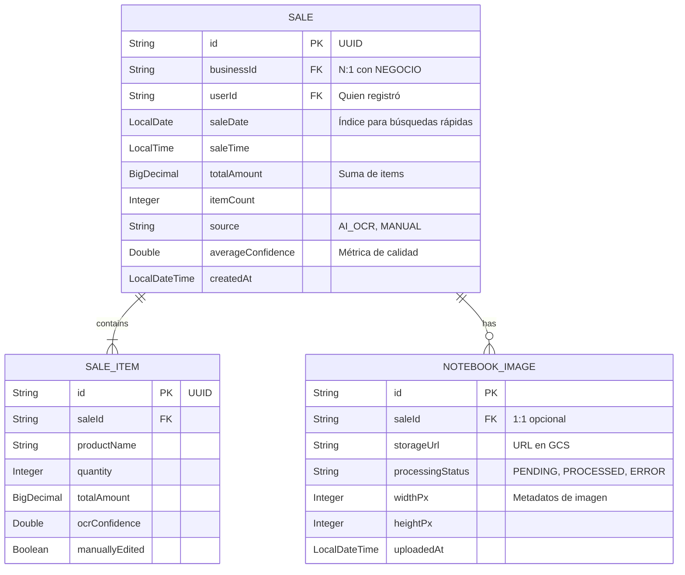

## MODELO DE DATOS ERD

### Diagrama Entidad-Relación Completo

### Estadísticas de la Base de Datos

| Tabla | Registros (Proyectado 30 días) | Tamaño Estimado |
|-------|--------------------------------|-----------------|
| NEGOCIO | 10 | < 1 MB |
| USUARIO | 20 | < 1 MB |
| VENTA | 300 (10 negoc. × 30 días) | ~5 MB |
| ITEM_VENTA | 1,500 (5 items/venta promedio) | ~15 MB |
| IMAGEN_CUADERNO | 200 | ~500 MB (imágenes en GCS) |
| **TOTAL** | **2,030 registros** | **~520 MB** |

---