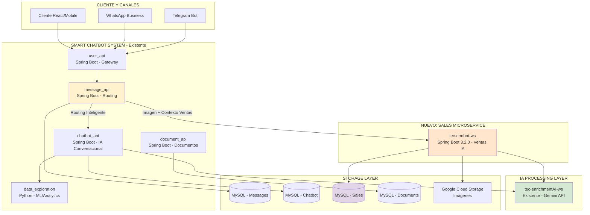
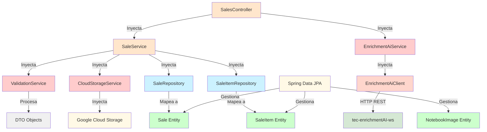
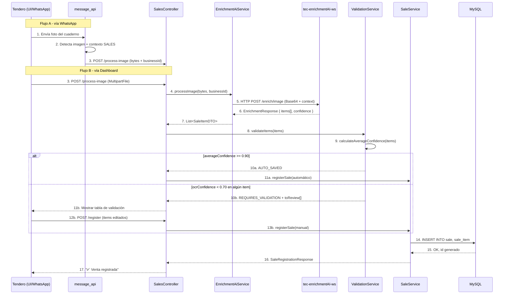

# Estructura del Proyecto - Smart Ventas IA

**Documento:** Arquitectura, paquetes y flujo de dependencias del workspace real  
**Basado en:** Arquitectura de microservicios existente + Análisis arquitectónico senior  
**Última actualización:** 25 de septiembre de 2026  
**Stack:** Spring Boot 3.2.0 + Java 17 (backend)  
**Workspace:** `/home/diego/workspace/tec-crmbot-ws`  
**Package Root:** `ec.com.technoloqie.crmbot.api`  
**Patrón:** API Gateway + Event-Driven + Database per Microservice

---

## 📋 TABLA DE CONTENIDOS

1. [Estructura General del Proyecto](#estructura-general-del-proyecto)
2. [Arquitectura de Microservicios](#arquitectura-de-microservicios)
3. [Estructura de Paquetes Java](#estructura-de-paquetes-java)
4. [Flujo de Dependencias](#flujo-de-dependencias)
5. [Componentes por Capa](#componentes-por-capa)
6. [Flujo de Datos End-to-End](#flujo-de-datos-end-to-end)

---

## ESTRUCTURA GENERAL DEL PROYECTO

```
tec-crmbot-ws/                              # Workspace raíz - Spring Boot 3.2.0 + Java 17
│
├── 📁 src/
│   ├── main/
│   │   ├── java/ec/com/technoloqie/crmbot/api/
│   │   │   ├── TecCrmbotWsApplication.java
│   │   │   ├── controller/
│   │   │   │   └── SalesController.java                 # REST endpoints
│   │   │   ├── service/
│   │   │   │   ├── SaleService.java                     # Lógica principal de ventas
│   │   │   │   ├── ValidationService.java               # Validación de datos OCR
│   │   │   │   ├── EnrichmentAiService.java             # Cliente HTTP a tec-enrichmentAI-ws
│   │   │   │   └── CloudStorageService.java             # Google Cloud Storage (opcional)
│   │   │   ├── client/
│   │   │   │   ├── EnrichmentAiClient.java              # HTTP Client para IA
│   │   │   │   └── MessageApiClient.java                # Cliente a tec-messages-ms (opcional)
│   │   │   ├── repository/
│   │   │   │   ├── SaleRepository.java                  # Spring Data JPA
│   │   │   │   └── SaleItemRepository.java              # Spring Data JPA
│   │   │   ├── model/
│   │   │   │   ├── Sale.java (@Entity)
│   │   │   │   ├── SaleItem.java (@Entity)
│   │   │   │   └── NotebookImage.java (@Entity)
│   │   │   ├── dto/
│   │   │   │   ├── SaleItemDTO.java
│   │   │   │   ├── ProcessImageRequest.java
│   │   │   │   ├── ProcessImageResponse.java
│   │   │   │   ├── SaleRegistrationRequest.java
│   │   │   │   ├── SaleRegistrationResponse.java
│   │   │   │   ├── KPIResponse.java
│   │   │   │   ├── ValidationResultDTO.java
│   │   │   │   ├── EnrichmentRequest.java               # Request a tec-enrichmentAI-ws
│   │   │   │   ├── EnrichmentResponse.java              # Response de tec-enrichmentAI-ws
│   │   │   │   └── EnrichmentItemDTO.java               # Item procesado por IA
│   │   │   ├── mapper/
│   │   │   │   ├── SaleMapper.java
│   │   │   │   ├── SaleItemMapper.java
│   │   │   │   └── EnrichmentMapper.java                # Mapeo AI Response ↔ DTO
│   │   │   ├── commons/
│   │   │   │   ├── exception/
│   │   │   │   │   ├── EnrichmentAiException.java       # Excepción servicio IA
│   │   │   │   │   ├── SaleNotFoundException.java
│   │   │   │   │   ├── ValidationException.java
│   │   │   │   │   ├── CloudStorageException.java       # (opcional)
│   │   │   │   │   └── SalesExceptionHandler.java       # @RestControllerAdvice
│   │   │   │   └── util/
│   │   │   │       ├── DateTimeUtils.java
│   │   │   │       ├── ImageUtils.java
│   │   │   │       ├── ValidationUtils.java
│   │   │   │       └── LoggingUtils.java
│   │   │   └── config/
│   │   │       ├── EnrichmentAiConfig.java              # Config cliente IA
│   │   │       ├── WebClientConfig.java                 # WebClient/RestTemplate
│   │   │       ├── CloudStorageConfig.java              # Config GCS (opcional)
│   │   │       ├── DataSourceConfig.java                # HikariCP
│   │   │       ├── RetryConfig.java                     # Spring Retry
│   │   │       └── CorsConfig.java                      # CORS
│   │   │
│   │   └── resources/
│   │       ├── application.properties                   # Config por defecto
│   │       ├── application-dev.properties               # Config desarrollo
│   │       ├── application-prod.properties              # Config producción
│   │       ├── application-test.properties              # Config testing
│   │       ├── logback-spring.xml                       # Logging SLF4J
│   │       └── db/
│   │           └── migration/
│   │               ├── V1__initial_schema.sql           # Flyway migration 1
│   │               └── V2__add_indexes.sql              # Flyway migration 2
│   │
│   └── test/
│       ├── java/ec/com/technoloqie/crmbot/api/
│       │   ├── TecCrmbotWsApplicationTests.java
│       │   ├── controller/
│       │   │   └── SalesControllerTest.java
│       │   ├── service/
│       │   │   ├── SaleServiceTest.java
│       │   │   ├── EnrichmentAiServiceTest.java
│       │   │   └── ValidationServiceTest.java
│       │   ├── client/
│       │   │   └── EnrichmentAiClientTest.java
│       │   └── integration/
│       │       └── SalesIntegrationTest.java
│       └── resources/
│           └── application-test.properties
│
├── 📁 docs/
│   ├── base-standards.md                    # Estándares generales del proyecto
│   ├── backend-standards.md                 # Estándares backend Spring Boot
│   ├── data-model.md                        # Modelo de datos ERD
│   ├── structure.md                         # Este archivo (arquitectura)
│   ├── tech.md                              # Stack tecnológico
│   ├── product.md                           # Especificación de producto
│   ├── verification.md                      # Criterios de verificación
│   ├── 2026-09-11-smart-ventas-ia-design-v2.md   # Design doc completo
│   └── 2026-09-11-smart-ventas-ia-plan.md        # Plan de implementación
│
├── 📁 ai-specs/
│   ├── agents/                              # Especificaciones de agentes
│   ├── docs/                                # Documentación para IA
│   └── skills/
│       └── refine-stories/
│           ├── SKILL.md
│           ├── assets/
│           ├── references/
│           └── scripts/
│
├── 📁 .agents/
│   └── skill/
│       └── refine-stories/
│           └── SKILL.md
│
├── 📁 .kiro/
│   ├── steering/                            # Archivos de steering/configuración
│   └── hooks/                               # Hooks de eventos del IDE
│
├── 📁 .mvn/                                 # Maven Wrapper binaries
├── 📁 .git/                                 # Git repository
├── 📁 .settings/                            # Eclipse IDE settings
├── 📁 target/                               # Artefactos compilados (Maven)
│
├── 📄 pom.xml                               # Configuración Maven (Spring Boot 4.1.1)
├── 📄 mvnw                                  # Maven Wrapper (Linux/Mac)
├── 📄 mvnw.cmd                              # Maven Wrapper (Windows)
├── 📄 .classpath                            # Eclipse classpath
├── 📄 .project                              # Eclipse project
├── 📄 .gitignore
├── 📄 .gitattributes
├── 📄 feature_list.json                     # Lista de features en formato JSON
├── 📄 AGENTS.md                             # Configuración de agentes Kiro
├── 📄 HELP.md
├── 📄 README.md
└── 📄 LICENSE
```

### Estadísticas del Proyecto

| Métrica | Valor |
|---------|-------|
| **Java Version** | 17 |
| **Spring Boot Version** | 4.1.1 |
| **Package Root** | ec.com.technoloqie.crmbot.api |
| **Build Tool** | Maven 3.x |
| **Paquetes Principais** | 9 (controller, service, client, repository, model, dto, mapper, config, commons) |
| **Entidades JPA** | 3 (Sale, SaleItem, NotebookImage) |
| **Configuraciones Spring** | 6 (EnrichmentAi, WebClient, CloudStorage, DataSource, Retry, CORS) |
| **Migraciones Flyway** | 2 (V1 schema, V2 indexes) |

---

## ARQUITECTURA DE MICROSERVICIOS

### Diagrama de Arquitectura Actualizada (Smart Chatbot System)



### Flujos de Integración

#### **Flujo A: Ventas vía WhatsApp (NUEVO)**
```
Tendero → WhatsApp → user_api → message_api → [Detecta imagen + contexto="SALES"] 
       → tec-crmbot-ws → tec-enrichmentAI-ws → MySQL → Respuesta estructurada
```

#### **Flujo B: Dashboard Ventas Directo (NUEVO)**
```
Dashboard React → tec-crmbot-ws → tec-enrichmentAI-ws → MySQL → KPIs tiempo real
```

#### **Flujo C: Chatbot Tradicional (SIN CAMBIOS)**
```
Cliente → user_api → message_api → chatbot_api → data_exploration → Respuesta
```

---

## ESTRUCTURA DE PAQUETES JAVA

### Árbol de Paquetes del Proyecto (ec.com.technoloqie.crmbot.api)

```
ec.com.technoloqie.crmbot.api/
│
├── TecCrmbotWsApplication.java
│   └── Main class con @SpringBootApplication
│
├── controller/
│   └── SalesController.java
│       ├── @PostMapping: /api/v1/sales/{businessId}/process-image
│       ├── @PostMapping: /api/v1/sales/{businessId}/register
│       ├── @GetMapping: /api/v1/sales/{businessId}/today
│       └── @GetMapping: /api/v1/sales/{businessId}/history
│
├── service/
│   ├── SaleService.java
│   │   ├── registerSale(businessId, request): Sale
│   │   ├── getTodaySales(businessId): List<Sale>
│   │   ├── getSaleHistory(businessId, days): List<Sale>
│   │   └── calculateKPIs(sales): KPIResponse
│   │
│   ├── ValidationService.java
│   │   ├── validateItems(items): ValidationResult
│   │   ├── calculateAverageConfidence(items): Double
│   │   └── determineAction(items): String
│   │
│   ├── EnrichmentAiService.java
│   │   ├── processImage(bytes, businessId): List<SaleItemDTO>
│   │   ├── processImageWithRetry(bytes, businessId): List<SaleItemDTO>
│   │   └── callEnrichmentApi(request): EnrichmentResponse
│   │
│   └── CloudStorageService.java (opcional)
│       ├── upload(bytes): String (URL)
│       ├── uploadWithMetadata(bytes, metadata): String
│       └── delete(objectName): void
│
├── client/
│   ├── EnrichmentAiClient.java
│   │   ├── processImage(request): EnrichmentResponse
│   │   ├── healthCheck(): Boolean
│   │   └── getServiceInfo(): ServiceInfo
│   │
│   └── MessageApiClient.java (opcional)
│       └── notifyImageProcessed(businessId, result): void
│
├── repository/
│   ├── SaleRepository.java (Spring Data JPA)
│   │   ├── findByBusinessIdAndSaleDate(businessId, saleDate): Sale
│   │   ├── findByBusinessIdAndSaleDateBetween(...): List<Sale>
│   │   └── @Query custom methods
│   │
│   └── SaleItemRepository.java (Spring Data JPA)
│       ├── findBySaleId(saleId): List<SaleItem>
│       └── @Query custom methods
│
├── model/
│   ├── Sale.java (@Entity @Table(name="sale"))
│   │   ├── id: String (UUID PK)
│   │   ├── businessId: String (FK)
│   │   ├── userId: String
│   │   ├── saleDate: LocalDate
│   │   ├── saleTime: LocalTime
│   │   ├── totalAmount: BigDecimal
│   │   ├── itemCount: Integer
│   │   ├── source: String (AI_OCR, MANUAL)
│   │   ├── averageConfidence: Double
│   │   ├── createdAt: LocalDateTime
│   │   └── items: List<SaleItem> (@OneToMany)
│   │
│   ├── SaleItem.java (@Entity @Table(name="sale_item"))
│   │   ├── id: String (UUID PK)
│   │   ├── saleId: String (FK)
│   │   ├── productName: String
│   │   ├── quantity: Integer
│   │   ├── totalAmount: BigDecimal
│   │   ├── ocrConfidence: Double
│   │   └── manuallyEdited: Boolean
│   │
│   └── NotebookImage.java (@Entity @Table(name="notebook_image"))
│       ├── id: String (PK)
│       ├── saleId: String (FK)
│       ├── storageUrl: String
│       ├── processingStatus: String (PENDING, PROCESSED, ERROR)
│       ├── widthPx: Integer
│       ├── heightPx: Integer
│       └── uploadedAt: LocalDateTime
│
├── dto/
│   ├── SaleItemDTO.java
│   │   ├── productName: String
│   │   ├── quantity: Integer
│   │   ├── totalAmount: BigDecimal
│   │   ├── ocrConfidence: Double
│   │   └── manuallyEdited: Boolean
│   │
│   ├── ProcessImageRequest.java
│   │   └── image: MultipartFile
│   │
│   ├── ProcessImageResponse.java
│   │   ├── action: String (AUTO_SAVED, REQUIRES_VALIDATION)
│   │   ├── preFilled: List<SaleItemDTO>
│   │   └── toReview: List<SaleItemDTO>
│   │
│   ├── SaleRegistrationRequest.java
│   │   ├── items: List<SaleItemDTO>
│   │   ├── source: String
│   │   └── averageConfidence: Double
│   │
│   ├── SaleRegistrationResponse.java
│   │   ├── id: String
│   │   ├── totalAmount: BigDecimal
│   │   ├── itemCount: Integer
│   │   └── createdAt: LocalDateTime
│   │
│   ├── KPIResponse.java
│   │   ├── dailyTotal: BigDecimal
│   │   ├── transactionCount: Integer
│   │   └── averageTicket: BigDecimal
│   │
│   ├── ValidationResultDTO.java
│   │   ├── action: String
│   │   ├── preFilled: List<SaleItemDTO>
│   │   └── toReview: List<SaleItemDTO>
│   │
│   ├── EnrichmentRequest.java
│   │   ├── imageData: String (Base64)
│   │   ├── context: String ("SALES_OCR")
│   │   └── businessId: String
│   │
│   ├── EnrichmentResponse.java
│   │   ├── success: Boolean
│   │   ├── items: List<EnrichmentItemDTO>
│   │   ├── confidence: Double
│   │   └── processingTime: Long
│   │
│   └── EnrichmentItemDTO.java
│       ├── product: String
│       ├── quantity: Integer
│       ├── amount: BigDecimal
│       └── confidence: Double
│
├── mapper/
│   ├── SaleMapper.java
│   │   └── toDTO(sale): SaleRegistrationResponse
│   ├── SaleItemMapper.java
│   │   └── toDTO(saleItem): SaleItemDTO
│   └── EnrichmentMapper.java
│       ├── toSaleItems(enrichmentItems): List<SaleItemDTO>
│       └── toEnrichmentRequest(imageData, businessId): EnrichmentRequest
│
├── config/
│   ├── EnrichmentAiConfig.java
│   │   └── @Bean enrichmentAiClient(): WebClient
│   ├── WebClientConfig.java
│   │   └── @Bean webClient(): WebClient
│   ├── CloudStorageConfig.java
│   │   └── @Bean storage(): Storage
│   ├── DataSourceConfig.java
│   │   └── HikariCP (maxPoolSize=10)
│   ├── RetryConfig.java
│   │   └── @Bean retryTemplate(): RetryTemplate
│   └── CorsConfig.java
│       └── WebMvcConfigurer para CORS
│
└── commons/
    ├── exception/
    │   ├── EnrichmentAiException.java (RuntimeException)
    │   ├── SaleNotFoundException.java (RuntimeException)
    │   ├── ValidationException.java (RuntimeException)
    │   ├── CloudStorageException.java (RuntimeException)
    │   └── SalesExceptionHandler.java (@RestControllerAdvice)
    │
    └── util/
        ├── DateTimeUtils.java
        ├── ImageUtils.java
        ├── ValidationUtils.java
        └── LoggingUtils.java
```

### Resumen de Paquetes

| Paquete | Responsabilidad | Archivos |
|---------|-----------------|----------|
| **controller** | REST endpoints | 1 |
| **service** | Lógica de negocio | 4 |
| **client** | HTTP Clients externos | 2 |
| **repository** | Persistencia JPA | 2 |
| **model** | Entidades JPA | 3 |
| **dto** | Transfer objects | 10 |
| **mapper** | Mapeo entidad-DTO | 3 |
| **config** | Configuración Spring | 6 |
| **commons.exception** | Manejo de errores | 5 |
| **commons.util** | Utilidades | 4 |
| **Total** | | **~40 archivos Java** |

---

## FLUJO DE DEPENDENCIAS

### Diagrama de Dependencias entre Paquetes



### Matriz de Dependencias

| Componente | Depende De | Tipo | Descripción |
|-----------|-----------|------|------------|
| **SalesController** | SaleService, EnrichmentAiService | Spring Bean | Orquesta requests HTTP |
| **SaleService** | SaleRepository, SaleItemRepository, ValidationService, EnrichmentAiService, CloudStorageService | Spring Bean | Lógica de negocio principal |
| **EnrichmentAiService** | EnrichmentAiClient, RetryTemplate | Spring Service | Delegación a microservicio IA |
| **EnrichmentAiClient** | WebClient | Spring Component | HTTP Client a tec-enrichmentAI-ws |
| **ValidationService** | DTO Objects | Spring Service | Validación de confianza OCR |
| **CloudStorageService** | Google Cloud Storage Client | Spring Service | Almacenamiento en GCS |
| **SaleRepository** | Spring Data JPA, Sale Entity | Repository | Persistencia MySQL |
| **SaleItemRepository** | Spring Data JPA, SaleItem Entity | Repository | Persistencia MySQL |

---

## COMPONENTES POR CAPA

### Capa de API REST (Spring Boot Controller)

```java
@RestController
@RequestMapping("/api/v1/sales")
public class SalesController {

    // POST /api/v1/sales/{businessId}/process-image
    // Input:  MultipartFile image
    // Output: ProcessImageResponse { action, preFilled[], toReview[] }

    // POST /api/v1/sales/{businessId}/register
    // Input:  SaleRegistrationRequest { items[], source, averageConfidence }
    // Output: SaleRegistrationResponse { id, totalAmount, itemCount, createdAt }

    // GET /api/v1/sales/{businessId}/today
    // Output: List<Sale>

    // GET /api/v1/sales/{businessId}/history?days=7
    // Output: List<Sale>
}
```

---

### Capa de Servicios (Spring Business Logic)

```java
SaleService
├── registerSale(businessId, request): Sale
├── getTodaySales(businessId): List<Sale>
├── getSaleHistory(businessId, days): List<Sale>
└── calculateKPIs(sales): KPIResponse

EnrichmentAiService
├── processImage(bytes, businessId): List<SaleItemDTO>
├── processImageWithRetry(bytes, businessId): List<SaleItemDTO>
└── callEnrichmentApi(request): EnrichmentResponse

ValidationService
├── validateItems(items): ValidationResult
├── calculateAverageConfidence(items): Double
├── determineAction(items): "AUTO_SAVED" | "REQUIRES_VALIDATION"
└── filterItemsToReview(items): List<SaleItemDTO>

CloudStorageService (opcional)
├── upload(bytes): String (storageUrl)
├── uploadWithMetadata(bytes, metadata): String
└── delete(objectName): void
```

### Capa de Clientes HTTP (Integraciones Externas)

```java
EnrichmentAiClient
├── processImage(request: EnrichmentRequest): EnrichmentResponse
├── healthCheck(): Boolean
└── getServiceInfo(): ServiceInfo
// Base URL: ${enrichment-ai.base-url}
// Timeout: ${enrichment-ai.timeout}
// Retry: Spring Retry con backoff exponencial
```

---

### Capa de Persistencia (Spring Data JPA)

```java
SaleRepository extends JpaRepository<Sale, String> {
    Optional<Sale> findByBusinessIdAndSaleDate(String businessId, LocalDate saleDate);
    List<Sale> findByBusinessIdAndSaleDateBetween(String businessId, LocalDate from, LocalDate to);
    List<Sale> findTop10ByBusinessIdOrderBySaleDateDesc(String businessId);
}

SaleItemRepository extends JpaRepository<SaleItem, String> {
    List<SaleItem> findBySaleId(String saleId);
    List<SaleItem> findBySaleIdAndManuallyEdited(String saleId, Boolean manuallyEdited);
}
```

---

### Capa de Modelos (Entities y DTOs)

```
Entities (JPA — fuente: data-model.md)
├── Sale           → tabla: sale
│                     id, businessId, userId, saleDate, saleTime,
│                     totalAmount, itemCount, source, averageConfidence, createdAt
├── SaleItem       → tabla: sale_item
│                     id, saleId, productName, quantity,
│                     totalAmount, ocrConfidence, manuallyEdited
└── NotebookImage  → tabla: notebook_image
                      id, saleId, storageUrl, processingStatus,
                      widthPx, heightPx, uploadedAt

DTOs (Transfer Objects)
├── SaleItemDTO              productName, quantity, totalAmount, ocrConfidence, manuallyEdited
├── ProcessImageRequest      image: MultipartFile
├── ProcessImageResponse     action, preFilled[], toReview[]
├── SaleRegistrationRequest  items[], source, averageConfidence
├── SaleRegistrationResponse id, totalAmount, itemCount, createdAt
├── KPIResponse              dailyTotal, transactionCount, averageTicket
└── ValidationResultDTO      action, preFilled[], toReview[]
```

---

### Capa de Configuración y Utilidades

```
config/
├── EnrichmentAiConfig.java    @Bean WebClient (apunta a tec-enrichmentAI-ws)
├── WebClientConfig.java       @Bean WebClient base con timeout/interceptors
├── CloudStorageConfig.java    @Bean Storage (opcional)
├── DataSourceConfig.java      HikariCP maxPoolSize=10
├── RetryConfig.java           exponentialBackoff(1000, 2, 5000), maxAttempts=3
└── CorsConfig.java            WebMvcConfigurer

commons/
├── exception/
│   ├── EnrichmentAiException.java
│   ├── SaleNotFoundException.java
│   ├── ValidationException.java
│   ├── CloudStorageException.java
│   └── SalesExceptionHandler.java   @RestControllerAdvice
└── util/
    ├── DateTimeUtils.java
    ├── ImageUtils.java
    ├── ValidationUtils.java
    └── LoggingUtils.java
```

---

## FLUJO DE DATOS END-TO-END



---

## SUMARIO DE COMPONENTES

| Componente | Tipo | Responsabilidad | Tecnología |
|-----------|------|-----------------|-----------|
| **message_api** | Microservicio existente | Routing + detección de imágenes | Spring Boot |
| **SalesController** | Spring REST | Orquestación HTTP | Spring Boot 3.2.0 |
| **SaleService** | Spring Service | Lógica de negocio | Spring Boot |
| **EnrichmentAiService** | Spring Service | Delegación a microservicio IA | Spring Boot |
| **EnrichmentAiClient** | Spring Component | HTTP Client externo | WebClient |
| **ValidationService** | Spring Service | Validación confianza OCR | Spring Boot |
| **CloudStorageService** | Spring Service | Almacenamiento imágenes (opcional) | Google Cloud Storage |
| **SaleRepository** | Spring Data JPA | CRUD operaciones | MySQL + JPA |
| **SaleItemRepository** | Spring Data JPA | CRUD operaciones | MySQL + JPA |
| **Sale** | JPA Entity | Cabecera de venta | MySQL |
| **SaleItem** | JPA Entity | Ítem de venta | MySQL |
| **NotebookImage** | JPA Entity | Metadatos imagen cuaderno | MySQL |
| **tec-enrichmentAI-ws** | Microservicio externo | Procesamiento IA / Gemini OCR | Spring Boot (existente) |

---

**Documento actualizado:** 25 de septiembre de 2026  
**Versión:** 2.0 - Arquitectura actualizada: sin Firebase, sin Gemini directo, integración con tec-enrichmentAI-ws  
**Estado:** ✅ Actualizado

### Notas de Implementación

- **Spring Boot 3.2.0** — versión correcta del proyecto
- **Sin Firebase**: MySQL es el único storage; no hay realtime push (se puede implementar con SSE o WebSockets en v2 si es necesario)
- **Sin Gemini directo**: toda la IA pasa por `tec-enrichmentAI-ws`, manteniendo separación de responsabilidades
- **Paquete `client/`**: nuevo paquete dedicado a clientes HTTP externos (mejor que mezclarlos en `service/`)
- **EnrichmentMapper**: mapea `EnrichmentResponse` → `List<SaleItemDTO>` antes de entrar al flujo de validación
- **RetryConfig**: los reintentos se aplican en `EnrichmentAiService`, no en el client, para no reintentar en errores 4xx
- Entidades alineadas con **data-model.md**: `Sale`, `SaleItem`, `NotebookImage`
